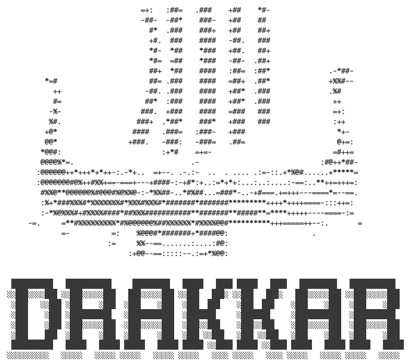

# DRAKKAR

DRAKKAR is a Snakemake-based, modular genome-resolved metagenomics pipeline optimized for the Globe Institute's HPC Mjolnir. It runs on Slurm, supports re-entrant modules, and produces standardized outputs for downstream analysis. Full docs: https://drakkar.readthedocs.io/

## Highlights

- Modular workflows: run the full pipeline or just the parts you need.
- HPC-friendly: Snakemake + Slurm with resource-aware rules.
- Reproducible outputs: consistent folder structure and metadata logs.
- Flexible inputs: directories or sample info tables.

## Quickstart

```
module load drakkar/1.0.0
drakkar complete -f input_info.tsv -o drakkar_output
```

## Workflow overview

DRAKKAR is organized into independent modules. Use `drakkar complete` to chain them.

- **Preprocessing**: quality filtering, optional host removal.
- **Cataloging**: assembly, binning, and coverage mapping.
- **Profiling**: dereplication and abundance estimation.
- **Annotating**: taxonomic and functional annotations.
- **Expressing**: metatranscriptomics mapping to annotated genes.
- **Dereplicating**: dereplication only, no read mapping.
- **Transfer**: SFTP transfer of selected outputs.

## Modules

### Preprocessing

- Quality-filtering using fastp.
- Optional host genome mapping and removal.
- Outputs cleaned reads and summary tables.

```
drakkar preprocessing {arguments}
```

### Cataloging

- Assembles reads into contigs.
- Bins contigs into MAGs.
- Supports individual assemblies, co-assemblies, and multicoverage mapping.

```
drakkar cataloging {arguments}
```

### Profiling

- Dereplicates MAGs to create a non-redundant reference set.
- Maps reads to the dereplicated genome catalogue.
- Optionally computes microbial fraction with singlem.

```
drakkar profiling {arguments}
```

### Annotating

- Taxonomic and functional annotation of MAGs.
- Outputs gene, cluster, and taxonomy tables.
- Use `--annotation-type` to select taxonomy/function/both.

```
drakkar annotating {arguments}
```

### Expressing

- Maps metatranscriptomics reads to annotated genes.
- Produces expression tables for MAGs and genes.

```
drakkar expressing {arguments}
```

### Dereplicating

- Runs only dereplication from profiling (no read mapping).
- Outputs dereplicated genomes to `dereplicating/final`.

```
drakkar dereplicating {arguments}
```

### Transfer

- Sends selected outputs via SFTP while preserving directory structure.
- Supports shortcuts for common output sets and ERDA defaults.

```
drakkar transfer {arguments}
```

## Complete mode

Run the full pipeline in one command:

```
drakkar complete {arguments}
```

## Inputs

You can provide inputs as a directory of reads or as a sample info table.

### Directory inputs (minimum)

```
drakkar complete -i {input_path} -o {output_path}
```

### Sample info table

A tab-separated file with optional columns depending on module usage:

|sample|rawreads1|rawreads2|reference_name|reference_path|coassembly|coverage|
|---|---|---|---|---|---|---|
|sample1|path/sample1_1.fq.gz|path/sample1_2.fq.gz|ref1|path/ref1.fna|assembly1,all|coverage1|
|sample2|path/sample2_1.fq.gz|path/sample2_2.fq.gz|ref1|path/ref1.fna|assembly2,all|coverage2|

Notes:
- Input read files can be local paths or remote URLs (http/https/ftp).
- The `coassembly` column defines which samples are pooled for co-assembly.
- `-m individual` adds per-sample assemblies in addition to any co-assemblies.
- If `--multicoverage` is set, samples sharing a coverage group map to each other's assemblies.
- Co-assemblies are not compatible with `--multicoverage`.

## Usage examples

### Run complete with a sample info file

```
drakkar complete -f {info_file} -o {output_path} -m individual
```

### Run preprocessing with a host reference

```
drakkar preprocessing -i {input_path} -o {output_path} -r {genome_path}
```

### Run profiling without microbial fraction

```
drakkar profiling -b {bins_dir} -R {reads_file} -o {output_path}
```

### Run dereplication only

```
drakkar dereplicating -b {bins_dir} -o {output_path}
```

### Transfer results to ERDA

```
drakkar transfer --erda -l {output_path} -r /remote/path --results -v
```

## Outputs

All modules write into the output directory you provide. Key locations:

- `preprocessing/` cleaned reads and summaries.
- `cataloging/` assemblies, bins, and metadata.
- `profiling_genomes/` dereplication, mapping, and abundance tables.
- `annotating/` annotation tables.
- `expressing/` expression outputs.
- `dereplicating/` dereplicated genomes (dereplication-only mode).

Each run also writes a metadata file `drakkar_YYYYMMDD-HHMMSS.yaml` capturing CLI arguments and run context.

## Transfer flags

- `--all`: transfer the entire output directory.
- `--data`: transfer everything except `.snakemake`.
- `--results`: transfer the union of `-a/-m/-p/-b`.
- `-a/--annotations`: annotation tables.
- `-m/--mags`: dereplicated MAGs.
- `-p/--profile`: profiling tables.
- `-b/--bins`: cataloging bins (recursive).
- `--erda`: use `io.erda.dk` with the default ERDA user.
- `-v/--verbose`: log each transfer on screen.

## Support and docs

- Docs: https://drakkar.readthedocs.io/
- Issues: https://github.com/alberdilab/drakkar
