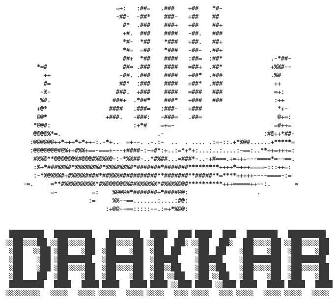

# DRAKKAR

DRAKKAR is a Snakemake-based, modular genome-resolved metagenomics pipeline optimized for the Globe Institute's HPC Mjolnir. It runs on Slurm, supports re-entrant modules, and produces standardized outputs for downstream analysis. Full docs: https://drakkar.readthedocs.io/

## Highlights

- Modular workflows: run the full pipeline or just the parts you need.
- HPC-friendly: Snakemake + Slurm with resource-aware rules.
- Reproducible outputs: consistent folder structure and metadata logs.
- Flexible inputs: directories or sample info tables.
- Recoverable runs: if an output directory is left locked by a broken Snakemake session, rerun with `--overwrite` to delete that directory and start cleanly.

## Quickstart

Install from GitHub if you are not using an HPC module:

```bash
pip install git+https://github.com/alberdilab/drakkar.git
```

Or, on Mjolnir:

```
module load drakkar/1.0.0
drakkar complete -f input_info.tsv -o drakkar_output
```

## Workflow overview

DRAKKAR is organized into independent modules. Use `drakkar complete` to chain them.

- **Preprocessing**: quality filtering, optional host removal.
- **Cataloging**: assembly, binning, and coverage mapping.
- **Profiling**: dereplication and abundance estimation.
- **Annotating**: taxonomic and functional annotations.
- **Expressing**: metatranscriptomics mapping to annotated genes.
- **Dereplicating**: dereplication only, no read mapping.
- **Database**: install or update one managed annotation database release.
- **Config**: view or edit the installed `workflow/config.yaml`.
- **Transfer**: SFTP transfer of selected outputs.

## Modules

### Preprocessing

Prepares raw metagenomic reads for downstream modules by filtering, trimming, and (optionally) removing host DNA. It produces cleaned paired reads and summary statistics.

Key options:
- `-i/--input`: input directory containing raw reads.
- `-f/--file`: sample info table (TSV) instead of an input directory.
- `-o/--output`: output directory (defaults to current working directory).
- `-r/--reference`: local path or URL to a host reference genome file for host removal.
- `-x/--reference-index`: local path or URL to a tarball containing a host reference FASTA and Bowtie2 index files; incompatible with `-r/--reference`.
- `-e/--env_path`: conda environments directory (shared).
- `-p/--profile`: Snakemake profile (default: slurm).

```
drakkar preprocessing {arguments}
```

### Cataloging

Builds assemblies and bins contigs into MAGs. It supports individual assemblies, co-assemblies, and coverage-based mapping strategies for binning.

Key options:
- `-i/--input`: input directory (preprocessed reads or sample info output).
- `-f/--file`: sample info table.
- `-o/--output`: output directory.
- `-m/--mode`: assembly modes (e.g. `individual,all`).
- `-c/--multicoverage`: map coverage groups across assemblies.
- `-e/--env_path`: conda environments directory.
- `-p/--profile`: Snakemake profile.

```
drakkar cataloging {arguments}
```

### Profiling

Quantifies genomes or pangenomes by mapping reads to a dereplicated reference set and summarizing abundance metrics.

Key options:
- `-b/--bins_dir`: directory of MAGs/bins.
- `-B/--bins_file`: text file listing MAG/bin paths.
- `-r/--reads_dir`: directory of metagenomic reads.
- `-R/--reads_file`: sample info table with reads.
- `-o/--output`: output directory.
- `-t/--type`: `genomes` or `pangenomes` (default: genomes).
- `-f/--fraction`: compute microbial fraction with singlem.
- `-a/--ani`: dereplication ANI threshold (default: 0.98).
- `-e/--env_path`: conda environments directory.
- `-p/--profile`: Snakemake profile.

```
drakkar profiling {arguments}
```

### Annotating

Annotates dereplicated MAGs with taxonomic and/or functional labels and produces per-genome tables.

Key options:
- `-b/--bins_dir`: directory of MAGs/bins.
- `-B/--bins_file`: text file listing MAG/bin paths.
- `-o/--output`: output directory.
- `--annotation-type`: comma-separated targets:
  - `taxonomy`
  - `function` (all functional components)
  - `genes` (gene-level only: `kegg,cazy,pfam,virulence,amr,signalp`)
  - `kegg`, `cazy`, `pfam`, `virulence` (`vfdb` alias), `amr`, `signalp`
  - `dbcan`, `antismash`, `defense`, `mobile` (`genomad` alias), `network`
- `--gtdb-version`: GTDB release number for taxonomy annotation. DRAKKAR uses `GTDB_DB_<version>` from `config.yaml`, such as `GTDB_DB_232`; if omitted, it uses `GTDB_DB`.
- `-e/--env_path`: conda environments directory.
- `-p/--profile`: Snakemake profile.

Output behavior for partial functional runs:
- `annotating/gene_annotations.tsv.xz` is produced when any gene-level source is selected (`kegg,cazy,pfam,virulence,amr,signalp,defense`).
- `annotating/cluster_annotations.tsv.xz` is produced when any cluster-level source is selected (`dbcan,antismash,defense,mobile`).
- Merged annotation tables can be generated from any subset of the functional sources above.

```
drakkar annotating {arguments}
```

### Expressing

Maps metatranscriptomics reads to annotated genes and reports expression metrics by gene and MAG.

Key options:
- `-b/--bins_dir`: directory of MAGs/bins.
- `-B/--bins_file`: text file listing MAG/bin paths.
- `-r/--reads_dir`: directory of transcriptome reads.
- `-R/--reads_file`: sample info table with transcriptome reads.
- `-o/--output`: output directory.
- `-e/--env_path`: conda environments directory.
- `-p/--profile`: Snakemake profile.

```
drakkar expressing {arguments}
```

### Dereplicating

Runs only the dereplication step from profiling and writes dereplicated MAGs to `dereplicating/final`.

Key options:
- `-b/--bins_dir`: directory of MAGs/bins.
- `-B/--bins_file`: text file listing MAG/bin paths.
- `-o/--output`: output directory.
- `-a/--ani`: dereplication ANI threshold (default: 0.98).
- `-e/--env_path`: conda environments directory.
- `-p/--profile`: Snakemake profile.

```
drakkar dereplicating {arguments}
```

### Database

Installs or updates one managed annotation database release at a time. This is a maintenance module and is not run automatically by `drakkar complete`.

Supported database commands:
- `kegg` (`kofams` alias)
- `cazy`
- `pfam`
- `vfdb`
- `amr`

Key options:
- `--directory`: base directory where the release folder will be created.
- `--version`: folder name to create inside `--directory`. For `kegg`, use the KEGG archive date such as `2026-02-01`. For `cazy`, use the upstream dbCAN release label such as `V14`. For `pfam`, use the Pfam release directory name such as `Pfam37.4`. For `amr`, use the NCBI AMRFinder release directory name such as `2025-07-16.1`. For `vfdb`, you can omit `--version` and DRAKKAR will use the download date in UTC, for example `2026-04-24`.
- `--download-runtime`: runtime in minutes for the database download/preparation rule (default: `120`).
- `--set-default`: update the matching database path in `drakkar/workflow/config.yaml` after a successful install.
- `-e/--env_path`: conda environments directory.
- `-p/--profile`: Snakemake profile.

Behavior:
- `drakkar` installs the selected database under `--directory/--version/`.
- For managed annotation databases, `config.yaml` stores the release directory, not the internal HMM or MMseqs prefix file.
- The workflow resolves the expected internal files automatically, for example `kofams`, `pfam`, `amr.tsv`, or `vfdb`.
- `--set-default` changes that config entry to the newly installed release directory.

Database-specific rules:
- `kegg` (`kofams`): use a KEGG archive date in `YYYY-MM-DD` format, such as `2026-02-01`. DRAKKAR downloads `profiles.tar.gz` from `https://www.genome.jp/ftp/db/kofam/archives/<version>/`, extracts the HMM profiles, concatenates them into a single `kofams` database, downloads the KEGG hierarchy JSON, and runs `hmmpress`. If the archive is missing, DRAKKAR points you to `https://www.genome.jp/ftp/db/kofam/archives/`. The default `--download-runtime` is `120` minutes and is mainly intended for this large download.
- `cazy`: use the dbCAN release label, such as `V14`. DRAKKAR downloads the dbCAN HMM database from `https://pro.unl.edu/dbCAN2/download_file.php?file=Databases/<version>/dbCAN-HMMdb-<version>.txt` and runs `hmmpress`. If the requested release is missing, DRAKKAR points you to `https://pro.unl.edu/dbCAN2/browse_download.php`.
- `pfam`: use the Pfam release directory name, such as `Pfam37.4`. DRAKKAR downloads `Pfam-A.hmm.gz` from `https://ftp.ebi.ac.uk/pub/databases/Pfam/releases/<version>/`, downloads the EC mapping table, unzips the HMM file, and runs `hmmpress`. If the requested release is missing, DRAKKAR points you to `https://ftp.ebi.ac.uk/pub/databases/Pfam/releases/`.
- `amr`: use the NCBI AMRFinder release directory name, such as `2025-07-16.1`. DRAKKAR downloads both `NCBIfam-AMRFinder.HMM.tar.gz` and `NCBIfam-AMRFinder.tsv` from `https://ftp.ncbi.nlm.nih.gov/hmm/NCBIfam-AMRFinder/<version>/`, merges the extracted HMMs into one database, and runs `hmmpress`. If the requested release is missing, DRAKKAR points you to `https://ftp.ncbi.nlm.nih.gov/hmm/NCBIfam-AMRFinder/`.
- `vfdb`: there is no upstream version directory. DRAKKAR downloads the current `VFDB_setB_pro.fas.gz` from `https://www.mgc.ac.cn/VFs/Down/VFDB_setB_pro.fas.gz`, creates the MMseqs2 database, and if `--version` is omitted it uses the UTC download date as the release folder and logged version, for example `2026-04-24`.

Version logging:
- Each run writes `database_versions.yaml` in the installed release directory.
- The log records the requested version, resolved install directory, source URLs, source-version label, and SHA256 checksums of the installed assets.

Examples:

```bash
drakkar database amr --directory /projects/alberdilab/data/databases/drakkar/amr --version 2025-07-16.1
drakkar database kegg --directory /projects/alberdilab/data/databases/drakkar/kofams --version 2026-02-01 --set-default
drakkar database kegg --directory /projects/alberdilab/data/databases/drakkar/kofams --version 2026-02-01 --download-runtime 180
drakkar database cazy --directory /projects/alberdilab/data/databases/drakkar/cazy --version V14 --set-default
drakkar database pfam --directory /projects/alberdilab/data/databases/drakkar/pfam --version Pfam37.4 --set-default
drakkar database vfdb --directory /projects/alberdilab/data/databases/drakkar/vfdb --set-default
```

### Config

Views or edits the installed DRAKKAR configuration file at `drakkar/workflow/config.yaml`.

Key options:
- `--view`: print the config file path and contents.
- `--edit`: open the config file in a terminal editor.

Behavior:
- `--edit` uses `$VISUAL`, then `$EDITOR`, then falls back to `nano`, `vim`, or `vi`.
- This command edits the installed package config directly, so changes affect subsequent workflow runs from that installation.

Examples:

```bash
drakkar config --view
drakkar config --edit
```

### Transfer

Transfers selected outputs via SFTP while preserving the original folder structure.

Key options:
- `--host` and `--user`: SFTP connection (optional if `--erda` is used).
- `--port`: SFTP port (default: 22).
- `-i/--identity`: SSH private key for authentication.
- `-l/--local-dir`: local output directory to transfer.
- `-r/--remote-dir`: remote destination directory.
- `--erda`: use ERDA defaults (`io.erda.dk` and the default ERDA user).
- `--all`: transfer the entire output directory.
- `--data`: transfer everything except `.snakemake`.
- `--results`: transfer the union of `-a/-m/-p/-b`.
- `-a/--annotations`: annotation outputs.
- `-m/--mags`: dereplicated MAGs.
- `-p/--profile`: profiling outputs.
- `-b/--bins`: cataloging bins (recursive).
- `-v/--verbose`: log each transfer on screen.

```
drakkar transfer {arguments}
```

## Complete mode

Run the full pipeline in one command:

```
drakkar complete {arguments}
```

## Inputs

You can provide inputs as a directory of reads or as a sample info table.

### Directory inputs (minimum)

```
drakkar complete -i {input_path} -o {output_path}
```

### Sample info table

A tab-separated file with optional columns depending on module usage:

|sample|rawreads1|rawreads2|reference_name|reference_path|coassembly|coverage|
|---|---|---|---|---|---|---|
|sample1|path/sample1_1.fq.gz|path/sample1_2.fq.gz|ref1|path/ref1.fna|assembly1,all|coverage1|
|sample2|path/sample2_1.fq.gz|path/sample2_2.fq.gz|ref1|path/ref1.fna|assembly2,all|coverage2|

Notes:
- Input read files can be local paths or remote URLs (http/https/ftp).
- `-r/--reference`, `-x/--reference-index`, and `reference_path` values can point to either local files or remote URLs (http/https/ftp). Reference inputs may be FASTA/compressed FASTA files or tarballs containing the FASTA plus Bowtie2 index files. Genome path lists passed through options such as `-B/--bins_file` can also use remote URLs; DRAKKAR downloads them into a local cache before running.
- Directory-style inputs such as `-i/--input` and `-b/--bins_dir` remain local filesystem paths.
- The `coassembly` column defines which samples are pooled for co-assembly.
- `-m individual` adds per-sample assemblies in addition to any co-assemblies.
- If `--multicoverage` is set, samples sharing a coverage group map to each other's assemblies.
- Co-assemblies are not compatible with `--multicoverage`.

## Usage examples

### Run complete with a sample info file

```
drakkar complete -f {info_file} -o {output_path} -m individual
```

### Run preprocessing with a host reference

```
drakkar preprocessing -i {input_path} -o {output_path} -r {genome_path}
```

### Run preprocessing with a prebuilt host reference index

```
drakkar preprocessing -i {input_path} -o {output_path} -x {reference_index_tarball}
```

### Run profiling without microbial fraction

```
drakkar profiling -b {bins_dir} -R {reads_file} -o {output_path}
```

### Run dereplication only

```
drakkar dereplicating -b {bins_dir} -o {output_path}
```

### Transfer results to ERDA

```
drakkar transfer --erda -l {output_path} -r /remote/path --results -v
```

## Outputs

All modules write into the output directory you provide. Key locations:

- `preprocessing/` cleaned reads and summaries.
- `cataloging/` assemblies, bins, and metadata.
- `profiling_genomes/` dereplication, mapping, and abundance tables.
- `annotating/` annotation tables.
- `expressing/` expression outputs.
- `dereplicating/` dereplicated genomes (dereplication-only mode).
- `<directory>/<version>/database_versions.yaml` database installation log for a managed database release.

Each run also writes a metadata file `drakkar_YYYYMMDD-HHMMSS.yaml` capturing CLI arguments and run context.

## Transfer flags

- `--all`: transfer the entire output directory.
- `--data`: transfer everything except `.snakemake`.
- `--results`: transfer the union of `-a/-m/-p/-b`.
- `-a/--annotations`: annotation tables.
- `-m/--mags`: dereplicated MAGs.
- `-p/--profile`: profiling tables.
- `-b/--bins`: cataloging bins (recursive).
- `--erda`: use `io.erda.dk` with the default ERDA user.
- `-v/--verbose`: log each transfer on screen.

## Support and docs

- Docs: https://drakkar.readthedocs.io/
- Issues: https://github.com/alberdilab/drakkar
